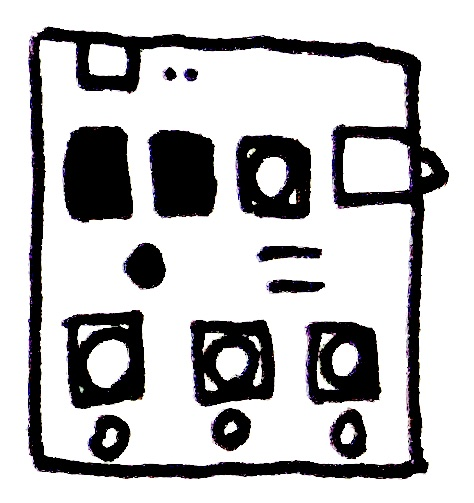
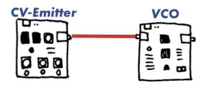

# CV-Emitter

## 回路図

## 部品
| 記号|名前|数量|備考|
|---|-----------|-------|-------|
| P1      | 基板用マイクロUSBコネクタ MRUSB-2B-D14NI-S306     |       1|[秋月電子](https://akizukidenshi.com/catalog/g/gC-10398/)|
| P2      | ピンソケットなど自由に     |       1|[秋月電子](https://akizukidenshi.com/catalog/g/gC-10097/)|
| R1, 2   | 抵抗器1kΩ[茶黒赤金]       |       2|[秋月電子](https://akizukidenshi.com/catalog/g/gR-25102/)|
| RV1~4   | 可変抵抗器100kΩ[104]     |       4|[秋月電子](https://akizukidenshi.com/)|
| C1      | 電解コンデンサ4.7uF     |       1|[秋月電子](https://akizukidenshi.com/)|
| IC1, 2  | オペアンプNJU7043D, ICソケット2x4     |       2|[秋月電子](https://akizukidenshi.com/)|
| SW1~3   | タクトスイッチ     |       3|[秋月電子](https://akizukidenshi.com/)|
| J1      | オーディオジャックMJ-352W-O     |       1|[秋月電子](https://akizukidenshi.com/)|

## 使い方
各つまみを回して出力する電圧を設定します。つまみの真下にあるスイッチを押している間、設定した電圧をCV OUTから出力します。
上段にあるつまみはポルタメントです。つまみを回すと、CV OUTから出力される電圧が推移するのにかかる時間を設定することができます。右に回すほど推移時間が長くなります。

## 調整方法
それぞれのボタンに対して、ボタンを押しながらつまみを回してちょうど良い電圧になるようにつまみの位置を決めます。つまみのいちを決める際は、ポルタメントの値は0（一番左）にしておくと良いでしょう。

## つなぎ方の例
 

## Licence
 この 作品 は <a rel="license" href="http://creativecommons.org/licenses/by-nc/4.0/">クリエイティブ・コモンズ 表示 - 非営利 4.0 国際 ライセンス</a>の下に提供されています。
